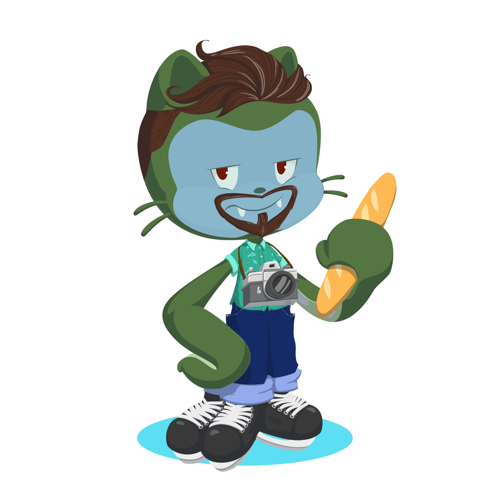

### Olá! Seja bem vindo! 📚

Esse site é sobre o **NRE Cornélio Procópio**, e é tarefa integrante do curso Embaixadores em Ação.

Algumas curiosidades sobre mim:

- 👨 Olá! Sou Flávio Bruniera.
- 🔭 Eu trabalho no Núcleo Regional da Educação em Cornélio Procópio.
- 👨‍💼 Atualmente, sou assessor pedagógico, responsável pelo Programa Edutech (Embaixador), Robótica (ADM) e Comunicação.
- 👯 Busco aprender mais sempre, para poder colaborar com os professores dos componentes do programa.
- Colecionador de 🎴 Cards Pokémon, 🚗 miniaturas de carros e 💮 flores.
- [📷@fbruniera](https://www.instagram.com/fbruniera/) | [🐦@flabruniera](https://twitter.com/flabruniera) | [📬flavio.bruniera@escola.pr.gov.br](flavio.bruniera@escola.pr.gov.br)
##### 

